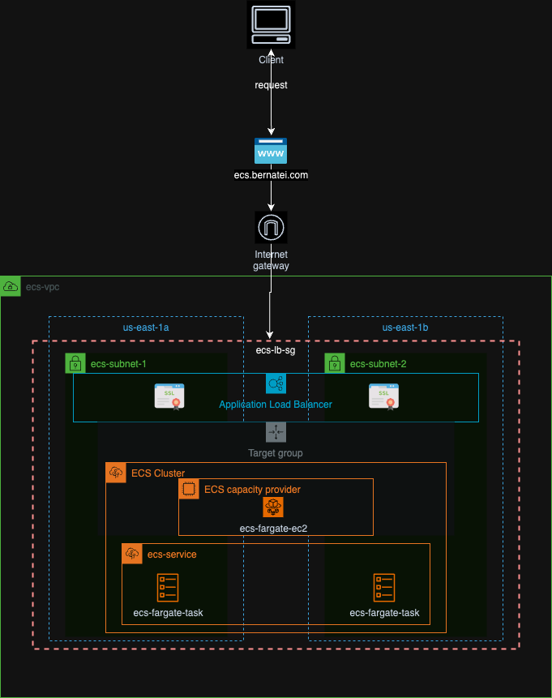

# Dockerize Personal Static Website utilizing ECS

### Project Introduction:
This project takes inspiration from my previous [CloudResume-Challenge](https://github.com/bertei/CloudResumeChallenge), where I created my personal website utilizing AWS Services like S3, CDN, AGW, DDB, Lambda, R53 and more. This time around I tried to dockerize it utilizing AWS services like ECR, ECS Fargate, VPC. Also, I made two GH Action workflows, one for the Terraform deployment and the other for the ECS image deployment.

### VPC
1. One VPC called "ecs-vpc".
2. Two Subnets (ecs-subnet-1 & ecs-subnet-2) with default ACLs.
3. One Internet Gateway.
4. One Route table with a local and IGW routes and an association to the 'ecs-subnets'.
5. One security group called "ecs-lb-sg" which contains two ingress rules (allowing http & https requests) and one egress rule (allowing all outbound traffic). This sg it's attached to "ecs-website-alb"
6. One Application LoadBalancer which will be listening for 'http/https' requests from the r53 domain (ecs.bernatei.com) then forwarding this requests to the Target group ("ecs-website-tg").
7. One Target Group ("ecs-website-tg") that redirects the requests to the registered targets (ecs-fargate machines) at port 80.
### ECR
1. One ECR Repository called "ecs-website-images" that contains the images that will be used by ECS services.
### ECS
1. One ECS Cluster named "ecs-fargate-cluster"
2. One ECS Task, "ecs-fargate-task", defining the container settings like it's name, image to use, cpu/memory, containerPort/hostPort, network mode, fargate use, OS, etc.
3. One ECS Service, "ecs-fargate-service", which utilizes the ECS Task definition to deploy the container into the cluster.
4. ECS Task role, "ecs-fargate-task-executionrole", so that ECS has permissions over ECR & Cloudwatch services.
### Workflows
1. The main objective of the "Terraform Workflow" is to automate the deployment of AWS resources. When a pull request is created, it triggers a terraform plan to check the changes. If all changes are approved and the pull request is merged, the workflow executes a terraform apply.
2. The second workflow, "Deploy to AWS ECS," automates the deployment of new images to the ECS cluster. When a change is detected in the /Website files, the workflow automatically builds, tags, and pushes a new image to ECR. Once the new image is stored in ECR, the workflow downloads the latest ECS task definition and updates it with the latest image tag. Finally, the workflow updates the ECS service to use the newly created ECS task definition, which deploys the container to the cluster.
